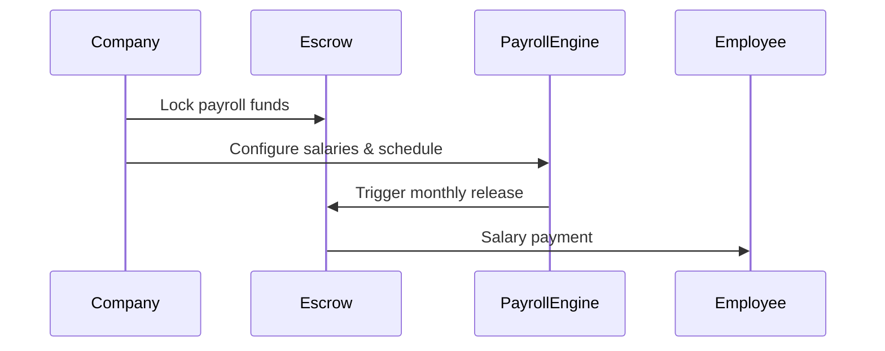
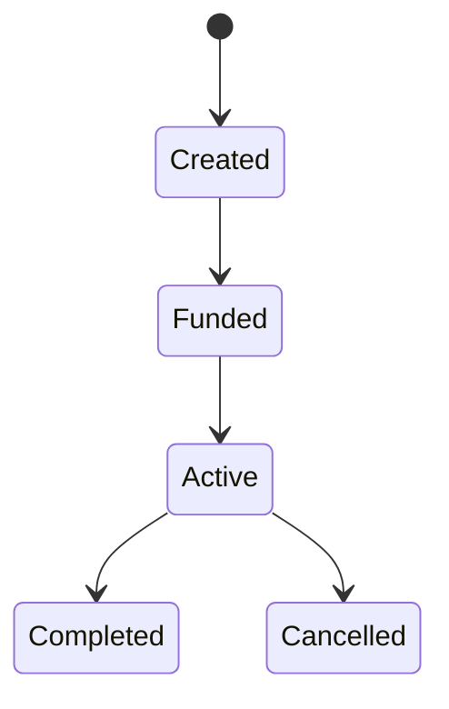
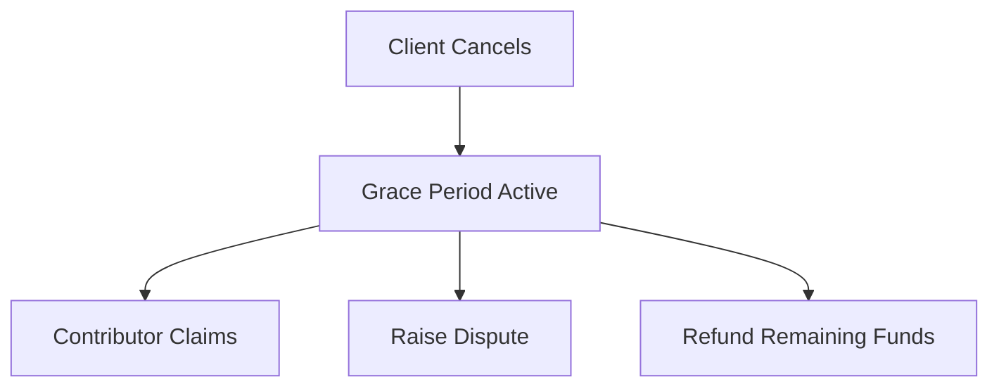
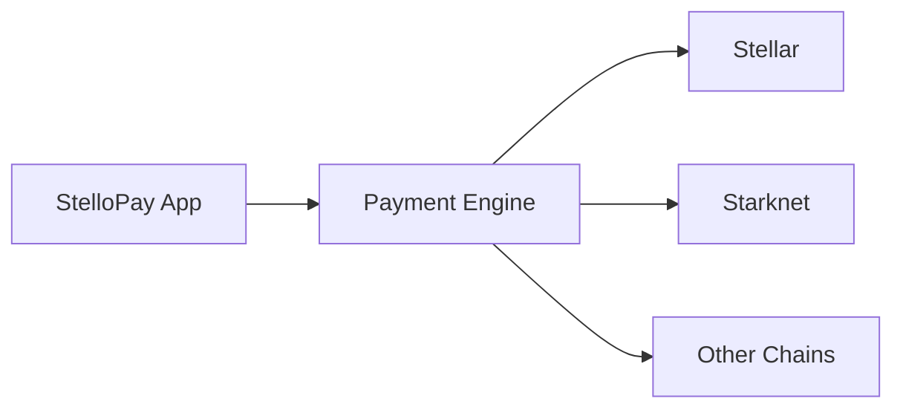

# StelloPay

## 🚀 Overview

**StelloPay** is a **multi-chain decentralized payroll and escrow platform** that enables companies to lock funds upfront and pay contributors automatically—whether as recurring payroll for employees or escrow-based payments for freelancers and contractors.

By combining **programmable smart contracts, escrow guarantees, grace periods, and dispute resolution**, StelloPay eliminates trust issues in global payments while enabling instant, low-cost, and transparent compensation across borders.

StelloPay is designed to work across **multiple blockchains**, starting with **Stellar** and **Starknet**, and expanding to other ecosystems in the future.

---

## 🌍 The Problem

Modern teams are global, but payroll systems are still broken.

### Traditional payroll and contractor payments suffer from:

- ❌ **High fees** – international bank transfers and intermediaries are expensive  

- ❌ **Slow settlement** – payments take days or weeks across borders  

- ❌ **Lack of trust** – freelancers fear non-payment; employers fear overpayment  

- ❌ **No transparency** – unclear payment status and disputes  

- ❌ **Limited access** – many contributors don't have reliable banking access  

There is **no unified system** that works for:

- Employees  

- Freelancers  

- Contractors  

- DAOs  

- Grant programs  

---

## 🌟 The StelloPay Solution

StelloPay introduces a **unified escrow-based payment protocol** that supports both:

1. **Automated Payroll (Employees)**

2. **Programmable Escrow (Freelancers & Contractors)**

### Key innovations:

- ✅ Funds are **locked upfront** in escrow

- ✅ Payments are released **automatically based on rules**

- ✅ Supports **time-based & milestone-based payments**

- ✅ Includes **cancellation protection + grace periods**

- ✅ Built-in **dispute resolution with arbiters**

- ✅ Works across **multiple blockchains**

- ✅ Instant, low-cost, and transparent payments

---

## 🎯 Who Is StelloPay For?

- Remote-first companies  

- Startups & enterprises  

- Freelancers & contractors  

- DAOs & Web3 teams  

- Grant programs & ecosystems  

- Gig economy platforms  

---

## 🧠 Core Business Model

> **Lock funds first.  

Define rules clearly.  

Let code enforce fairness.**

StelloPay treats **payroll as a special case of escrow**.

---

## 🔄 Two Core Payment Modes

---

### 🧑‍💼 Mode 1: Payroll (Employees)

#### Flow:

1. Company adds employees and salary configuration

2. Company locks total payroll funds upfront

3. Salaries are released automatically every pay cycle

4. Employees receive instant payments to their wallets

5. Unused funds are refundable if payroll is stopped

#### Mermaid: Payroll Flow



---

### 🧑‍💻 Mode 2: Freelance / Contract Escrow

#### Flow:

1. Client initializes an agreement

2. Client locks funds upfront

3. Agreement becomes active

4. Payments are released based on time or milestones

5. Contract completes automatically or is cancelled safely

#### Mermaid: Freelance Escrow Flow



---

## ⏱ Time-Based Payments

**Used for:**

- Salaries

- Weekly / monthly contracts

```
Payment = elapsed_time × rate
```

Contributor can claim earned funds periodically.

---

## 🎯 Milestone-Based Payments

**Used for:**

- Deliverables

- Freelance projects

- Grants

```
Approve milestone → Claim → Release funds
```

Approval acts as an irreversible commitment.

---

## 🛑 Cancellation + Grace Period (Critical Protection)

StelloPay prevents unfair cancellations.

**If a client cancels early:**

1. Agreement moves to Cancelled

2. Grace period starts (e.g., 7 days)

3. During grace period:
   - Contributor can claim earned payments
   - Contributor can raise a dispute

4. After grace period:
   - Remaining funds are refunded if no dispute exists

#### Mermaid: Cancellation Logic



---

## ⚖️ Dispute Resolution (Human-in-the-Loop)

When disputes arise, StelloPay uses arbiters.

**How disputes work:**

1. Contributor raises dispute during grace period

2. Arbiter reviews on-chain data + off-chain proof

3. Arbiter decides:
   - Pay contributor
   - Refund client
   - Split funds

4. Decision is enforced on-chain

This ensures fairness without centralized control.

---

## 🌐 Multi-Chain Architecture

StelloPay is chain-agnostic by design.

**Supported (now & future):**

- Stellar → fast, low-cost payroll

- Starknet → programmable escrow & disputes

- Future EVM / L2 chains → scalable expansion

**Key insight:**

- Business logic stays the same.

- Execution adapts per chain.

#### Mermaid: Multi-Chain Architecture


